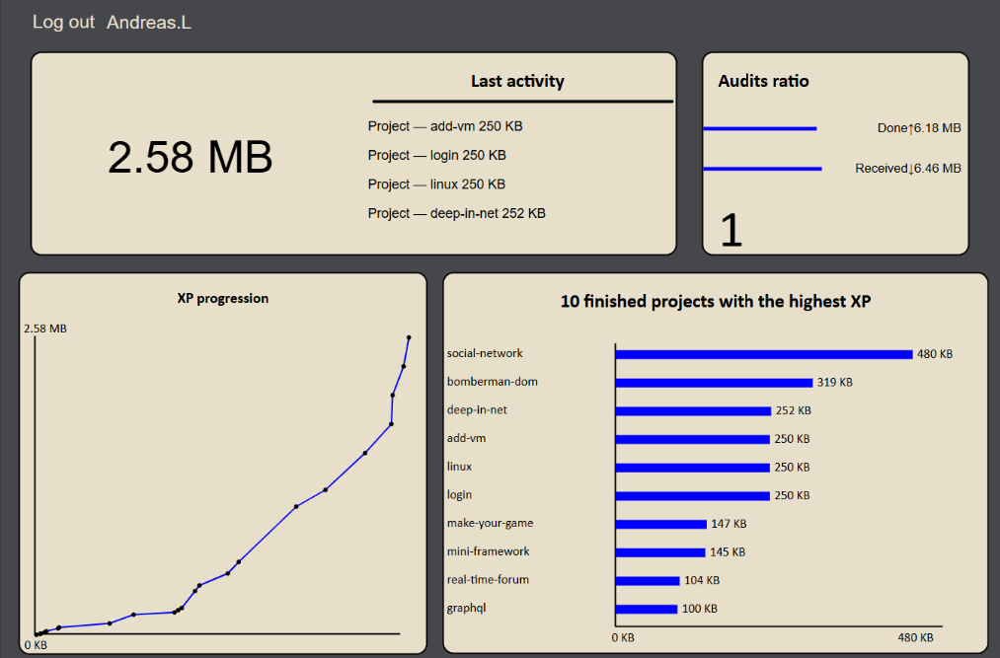

# Graphql

## Description

The GraphQL Profile Project is a web-based application that provides users with a detailed profile view  XP, audit ratios, and other statistics. 
The objective of this project is to learn the GraphQL query language, by creating your own profile page.

## Project Structure

Frontend: HTML, CSS , and JavaScript  
Authentication: Secure access via JWT, with token stored in localStorage.  
GraphQL: Queries data from tables such as user, transaction, and progress information. 

The project is live on GitHub Pages: https://ghoyl.github.io/Graphql/